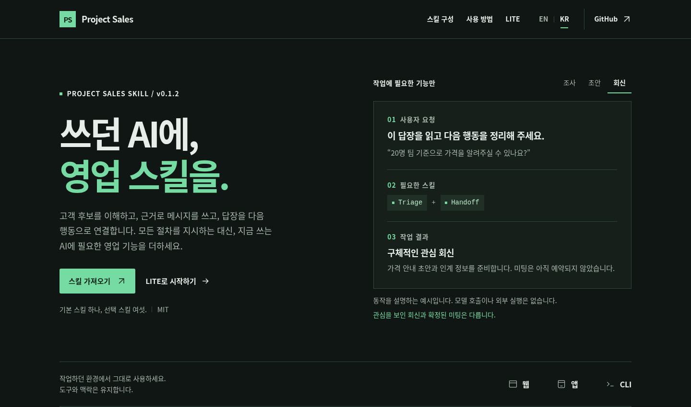

# Project Sales Skill

**쓰던 AI에, 영업 스킬을.**

[](CHANGELOG.md)
[](LICENSE)
[](README.md)

**[소개 페이지 열기](https://jtech-co.github.io/Project-Sales-Skill/)** · [LITE 복사](LITE-KR.md) · [빠른 시작](QUICKSTART-KR.md) · [English](README.md)

[](https://jtech-co.github.io/Project-Sales-Skill/?lang=ko)

제품 조사, 후보 평가, 메시지 초안, 회신 분류, 대화 인계, 성과 검토를 현재 쓰는 AI에 더한다. **기본 스킬 하나가 필요한 지침만 선택하며, 선택 스킬 여섯 개는 각각 독립적으로 사용한다.** 고정된 절차나 다중 에이전트 팀을 강제하지 않는다.

> [!NOTE]
> **초안 전용.** 분석·초안·실행 제안서를 만들며, 메일 발송·원격 초안 저장·CRM 수정·일정 초대·예약 실행은 하지 않는다. 연결된 읽기 도구도 호스트의 허가가 필요하며, 지침 자체가 권한을 부여하지 않는다.

## 쓰던 환경에서 시작

| 환경 | 사용 방법 |
|---|---|
| **웹 / 대화창** | [LITE-KR](LITE-KR.md)을 붙이고 작업·제품 설명·명단·회신을 전달한다. 설치는 필요 없다. |
| **CLI / 네이티브 스킬** | 아래 명령으로 기본 스킬을 설치하거나 역할에 맞는 [선택 스킬](optional-skills/README.md)만 사용한다. |
| **자체 앱** | 현재 도구에 [지침 로더와 읽기 연결 모듈](adapters/app/README.md)을 연결한다. |

저장소 루트에서 호스트의 실제 스킬 경로를 지정한다.

```sh
python scripts/install.py --dest ../my-project/.agents/skills --dry-run
python scripts/install.py --dest ../my-project/.agents/skills
```

기존 대상 폴더는 덮어쓰지 않는다. 호스트별 경로는 [CLI 안내](adapters/cli/README.md)를 참조한다. 설치용 파일만 필요하면 [기본 스킬 ZIP](dist/project-sales-core.zip) 또는 [선택 스킬 ZIP](dist/project-sales-specialists.zip)을 사용한다.

## 필요한 여섯 기능

| 스킬 | 결과물 |
|---|---|
| [Discovery](references/DISCOVERY.md) | 제품 사실, 고객군 가설, 제외 기준 |
| [Qualification](references/QUALIFICATION.md) | 후보별 적합 근거, 출처, 미확인 사항 |
| [Outreach](references/OUTREACH.md) | 근거를 갖춘 첫 메일·후속 메시지 초안 |
| [Triage](references/TRIAGE.md) | 회신 의도, 판단 근거, 다음 행동 |
| [Handoff](references/HANDOFF.md) | 대화 맥락, 약속 사항, 예약 상태 |
| [Review](references/REVIEW.md) | 관측된 성과, 분모, 확인된 비용 |

## 더 살펴보기

[소개 페이지](https://jtech-co.github.io/Project-Sales-Skill/)는 다크 테마·초록색 강조·EN/KR 전환·환경별 예시·LITE 복사 및 다운로드를 담은 단일 `index.html`이다. 빌드·CDN·백엔드가 필요 없다. 위 이미지는 해당 페이지의 실제 캡처이며, 에이전트의 실시간 실행 결과가 아니다.

[기본 SKILL](SKILL.md) · [연결 안내](adapters/README-KR.md) · [사용 예시](examples/TASKS.md) · [검증 기록](VALIDATION.md) · [변경 이력](CHANGELOG.md) · [사이트 안내](SITE-NOTES-KR.md)

[MIT 라이선스](LICENSE)를 적용한다. 모델 응답 품질·호스트 설치 화면·실제 외부 서비스 연결은 로컬 코드 검사와 별개이며, 배포 전 검증 범위를 확인한다.
