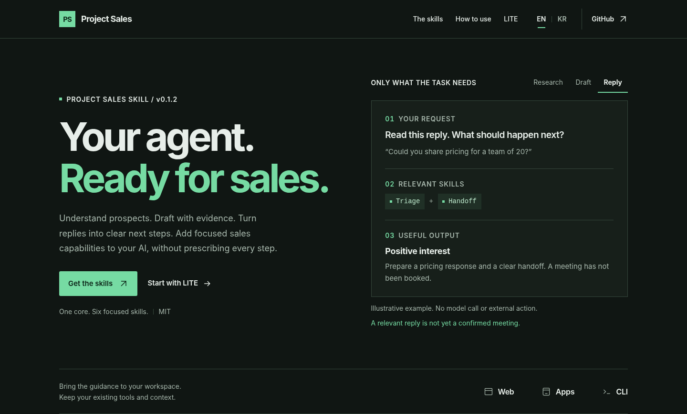

# Project Sales Skill

**Your agent. Ready for sales.**

[](CHANGELOG.md)
[](LICENSE)
[](README-KR.md)

**[Open the introduction](https://jtech-co.github.io/Project-Sales-Skill/)** · [Copy LITE](LITE.md) · [Quick start](QUICKSTART.md) · [한국어](README-KR.md)

[](https://jtech-co.github.io/Project-Sales-Skill/)

Add product research, prospect qualification, message drafting, reply triage, handoff, and outcome review to your existing AI agent. **One core skill routes to the relevant guidance; six optional specialists can work independently.** No fixed pipeline or mandatory agent team.

> [!NOTE]
> **Draft-only.** This package produces analysis, drafts, and action proposals. It does not send mail, save remote drafts, write to CRM, create invitations, or run a scheduler. Connected reads require host authorization; instructions do not grant permissions.

## Start in your workspace

| Environment | Start here |
|---|---|
| **Web / chat** | Paste [LITE](LITE.md) and add your task, product brief, list, or reply. No installation. |
| **CLI / native skill** | Install the core below, or choose [specialists](optional-skills/README.md) for separate roles. |
| **Your app** | Use the [context loader and read bridge](adapters/app/README.md) with your own tools. |

From the repository root, choose the skill directory for your host:

```sh
python scripts/install.py --dest ../my-project/.agents/skills --dry-run
python scripts/install.py --dest ../my-project/.agents/skills
```

Existing target folders are not overwritten. See the [CLI guide](adapters/cli/README.md) for host-specific paths. Prefer a ready-made archive? Use the [core ZIP](dist/project-sales-core.zip) or [specialist ZIP](dist/project-sales-specialists.zip).

## Six focused capabilities

| Skill | What you get |
|---|---|
| [Discovery](references/DISCOVERY.md) | Product facts, customer-fit hypotheses, exclusion criteria |
| [Qualification](references/QUALIFICATION.md) | Fit evidence, sources, verification gaps |
| [Outreach](references/OUTREACH.md) | A grounded first-message or follow-up draft |
| [Triage](references/TRIAGE.md) | Reply intent, decisive evidence, next action |
| [Handoff](references/HANDOFF.md) | Conversation context, commitments, booking status |
| [Review](references/REVIEW.md) | Observed outcomes, denominators, and known costs |

## Explore the package

The [introduction](https://jtech-co.github.io/Project-Sales-Skill/) is one self-contained `index.html`: dark theme, green highlights, EN/KR switching, usage examples, and complete LITE copy/download. No build, CDN, or backend is needed. README images are actual captures of that page, not live agent results.

[Core SKILL](SKILL.md) · [Integration guides](adapters/README.md) · [Examples](examples/TASKS.md) · [Validation](VALIDATION.md) · [Changelog](CHANGELOG.md) · [Site notes](SITE-NOTES.md)

Licensed under [MIT](LICENSE). Model behavior, native host installation, and live providers are separate from the included local code checks; see the validation scope before deployment.
